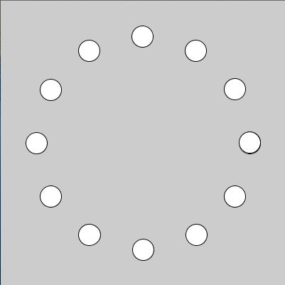
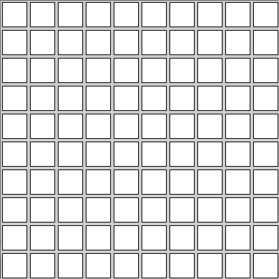
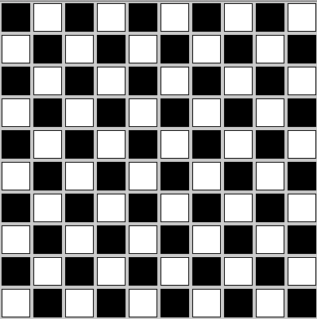

# プログラミングテスト
## 1. 次の図形を描きなさい
次の条件に従って図のような図形を描きなさい．

* 画面サイズ: 400x400 px
* ○の大きさ: 直径30px
* 中心からの距離: r = 150
* ○の角度の間隔: PI / 6
* 三角関数(sin, cos)を用いること
* translateメソッドを用いても良い
	* translate(200, 200)とすると原点が(200, 200)の位置にずれる

## 2. 次のアニメーションを作成しなさい
1で描いた図形を200, 200を中心に回転するアニメーションを作成しなさい，

## 3. 次の図形を描きなさい
* 縦10個，横10個の四角形を描きなさい

## 4. 次の図形を描きなさい
3の図形に下の画像の様な規則で色をつけなさい．

## 模範解答
模範解答のプログラムは[こちら](program.html)